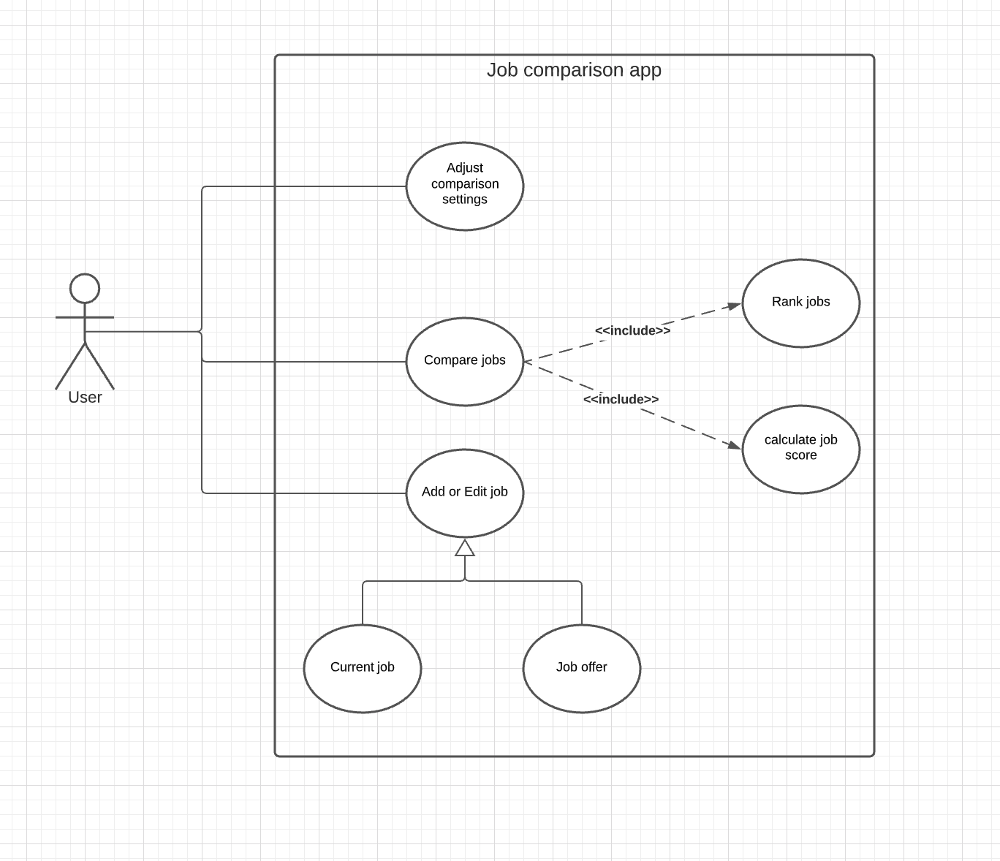

# Use Case Model

**Author**: Team 138

## 1 Use Case Diagram

## 2 Use Case Descriptions

### Add Job

- This use case allows the user to enter job details in the app. The job can be the user's current job or a job offer they have received
- Scenarios:
    - Open App / Main Menu
    - Click *Add Job* Button
    - Fill details
    - Check *Current Job* box if entering current job details.
    - Click *Save* Button or *Cancel Button* to return to Main Menu

### Adjust Comparison Settings

- This use case allows the user adjust the weights of various job features which are used to to calculate overall job score
- Scenarios:
    - Open App / Main Menu.
    - Click *Comparison Settings* Button.
    - Input numbers in settings text box.
    - Click *Save* Button.

### Compare Jobs

- This use case allows the user compare 2 jobs based on the job score
- Pre-conditions: Users should have at-least 2 jobs
- Post-conditions: Should run **Rank Jobs** to list all jobs based on score
- Scenarios:
    - Open App / Main Menu.
    - Click *Comparison Offers* Button.
    - Select exactly 2 jobs & click *Comapre* Button.
    - View Comparison Table.
        - Click *Compare Another* Button to start new comparison.
        - Or click *Main Menu* to return to Main Menu

