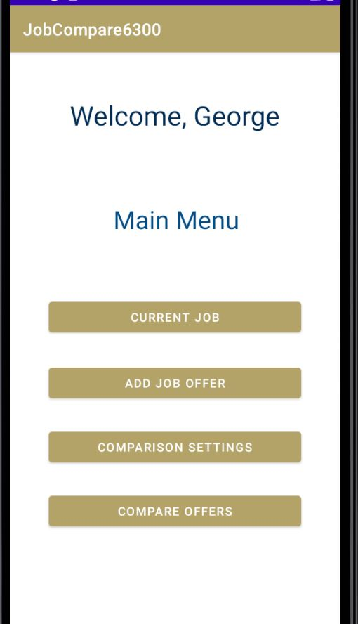
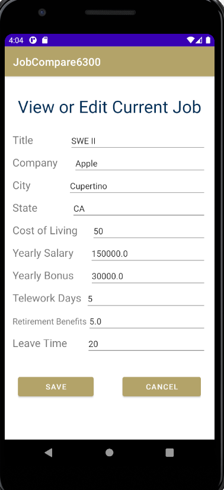
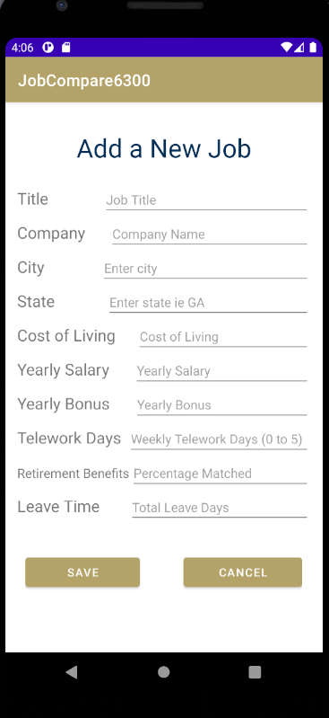
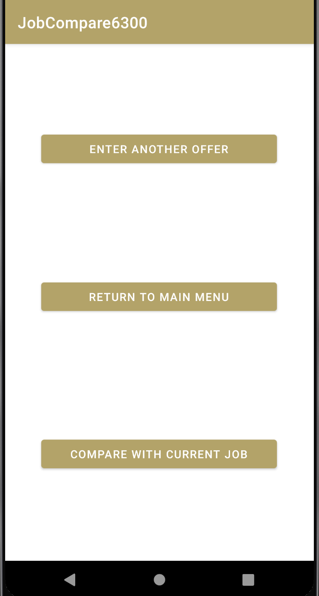
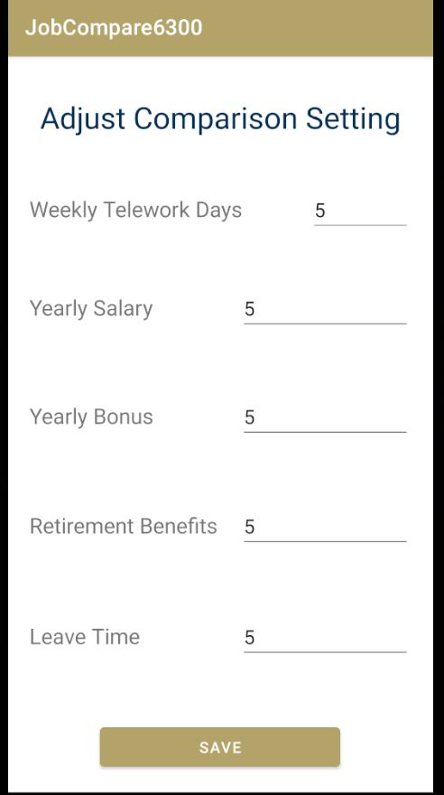
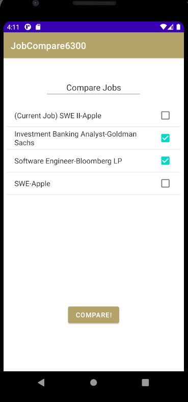
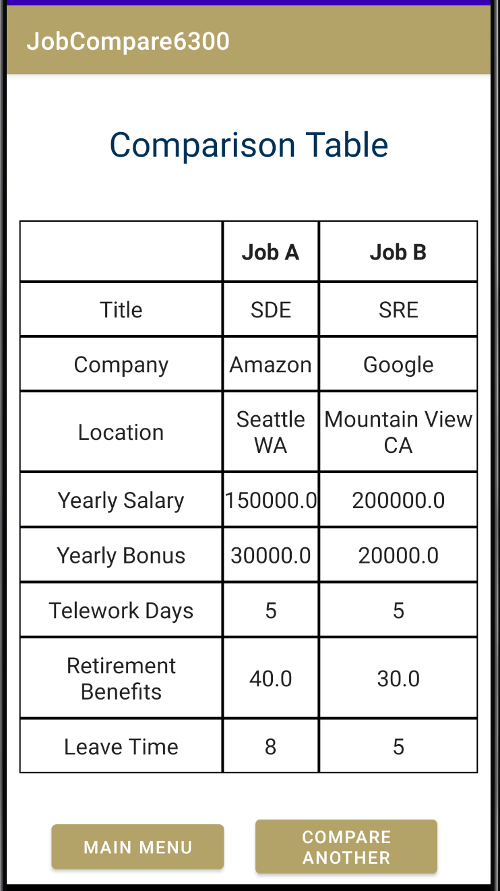

# Job Comparison Application Team 138

## Getting Started

The job comparison application, available exclusively for android, is an application that will allow you to store  
and compare job offers. Please note that for optimal experience that reflects the original design intention, we require the system to be run on a Pixel 3 (larger screen surface).

The application will keep track of your current job, and will let you add any number of job offers and compare 
 them based off salary, leave time, remote work days, and the bonus payment. 

You can adjust the weights of each of these criteria, allowing you to put more weight into what you think is a better benefit!

## Main Menu

The Main Menu presents with you four different options for making use of the application:
* <b>Current Job</b> - Allows you to enter your current job, if you do not have one. If you do have one, allows you to edit the details of your current job.
* <b>Add Job Offer</b> - Allows you to add a job offer that you can compare with other offers in the 'Compare Offers' screen.
* <b>Comparison Settings</b> - Allows you to adjust the comparison settings that are used to compute which job offers are better.
* <b>Compare Offers</b> - Allows you to compare your job offers.

## Current Job

Pressing 'Current Job' will allow you to either set or edit your Current Job (if one exists).

Simply provide a:  

* Title - Title of the Job.
* Company Name - Name of the Company.
* City - The jobs city.
* State - The jobs state.
* Cost of Living - A number that represents the Cost of Living in the city.
* Yearly Salary - The yearly salary.
* Yearly Bonus - The yearly bonus.
* Telework Days - The number of days per week that you're allowed to work from home.
* Retirement Benefits - The percentage of company matched contributions.
* Leave Time - How much leave time you're allowed.

and press 'Save'. This will save your current job.

## Add Job Offer

Similar to adding your current job, you can add any number of Job Offers to later be compared.

Simply provide a:  

* Title - Title of the Job.
* Company Name - Name of the Company.
* City - The jobs city.
* State - The jobs state.
* Cost of Living - A number that represents the Cost of Living in the city.
* Yearly Salary - The yearly salary.
* Yearly Bonus - The yearly bonus.
* Telework Days - The number of days per week that you're allowed to work from home.
* Retirement Benefits - The percentage of company matched contributions.
* Leave Time - How much leave time you're allowed.

Press 'Save' to save the Job offer.

## Post Saving Navigation

After you save the job, you will be provided with 3 options:

* **Enter Another Offer** - Go back to the "Add a new job" page to add another job

* **Return To Main Menu** - Return to the main menu

* **Compare With Current Job** - Compare the job which you just added with the current job. If there is no current job, this button is invalid and appears grey.

## Comparison Settings

You can adjust the comparison settings for how jobs are ranked. Simply provide weights, from 1 to 9, for the following inputs:

A 1 indicates that you put the least amount of value on a particular weight. A 9 would mean that you want to make that particular value worth more.

* Weekly Telework Days
* Yearly Salary
* Retirement Benefits
* Leave Time

## Compare Offers

Compare two job offers here. You will first be presented with a list of your job offers, in order of best to worst. 

You can further compare two job offers directly by  
selecting two job offers and pressing 'Compare'. When 'Compare' is pressed, you will be presented with a table comparing each job head-to-head (see above).

